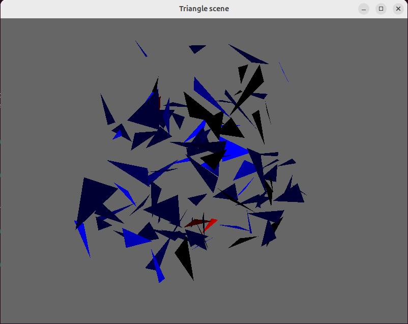

# Visualization of triangles

## Introduction

This project is an implementation of the visualization of triangles using the library [OpenGL](https://www.opengl.org/). Triangles that intersect with each other are colored red, the rest are colored blue. 

## Build and Run

If you want to build the project, write this in the project directory:
```
cmake -S . -B build
cmake --build build
```

After that, you can run main target program:

```
./build/src/main
```

## Using
To move the camera use `W` `A` `S` `D` or arrow keys on your keyboard. To zoom in/out use `Ctrl` and `+`/`-`. To speed up the camera press `Shift`.

## Example

